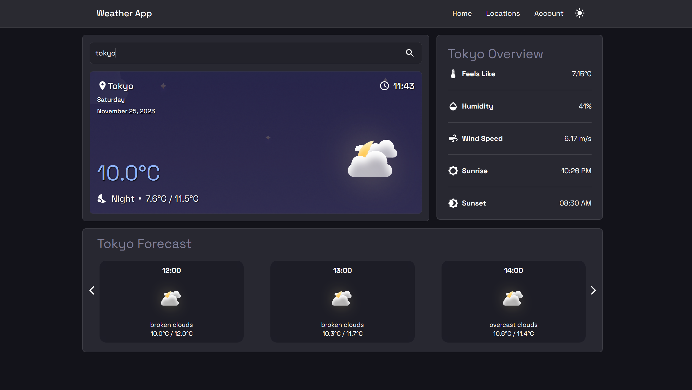
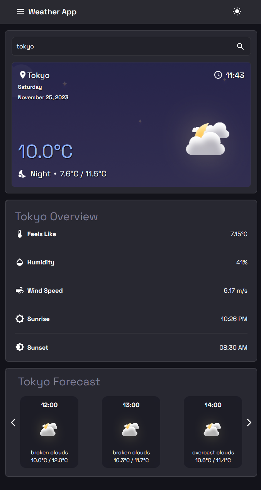

# 🌤️ Weather App

Weather app made with React and the OpenWeatherMap API that shows the current weather of your city with an hourly forecast.

## 🛠️ Tech Stack

<div>
  &nbsp;
  &nbsp;
</div>

## 🚀 Dependencies


## 🏗️ Setup

1. Install dependencies

```sh
npm i
```

2. Run the Weather App

```sh
npm start
```

## 📈 Progress

### 🖥️ Desktop View


### 📱 Mobile View


