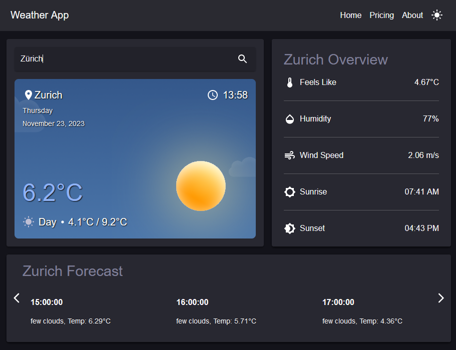

# 🌤️ Weather App

Weather app made with React and the OpenWeatherMap API that shows the current weather of your city with an hourly forecast.

## 🛠️ Tech Stack

&nbsp;


## 🚀 Dependencies


## 🏗️ Setup

1. Install dependencies

```sh
npm i
```

2. Run the Weather App

```sh
npm start
```

## 📈 Progress



